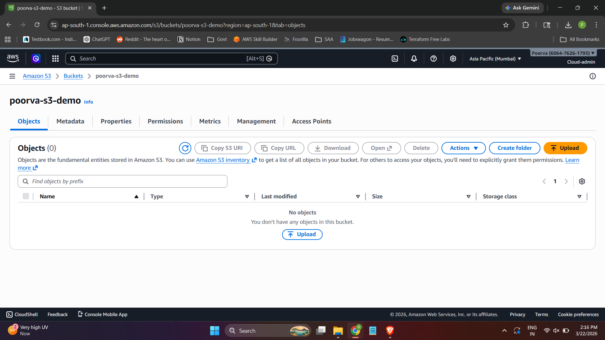
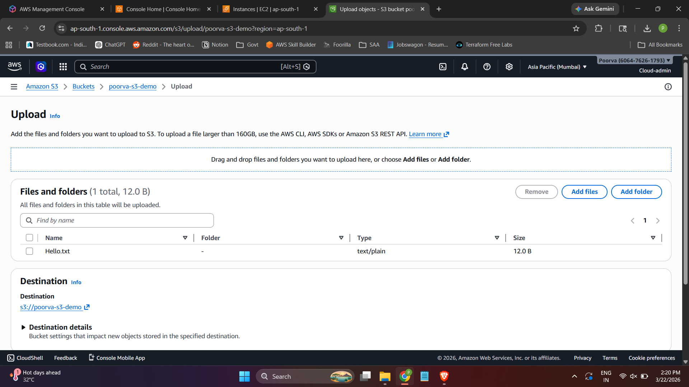
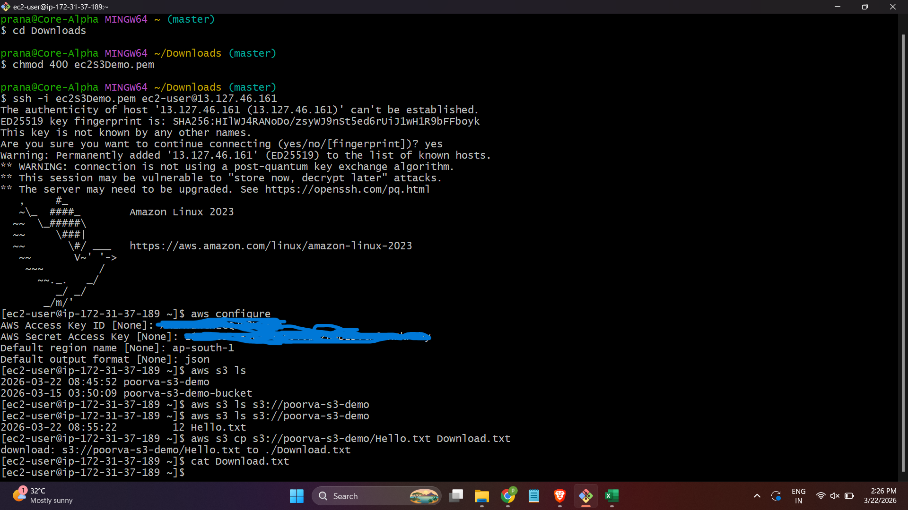
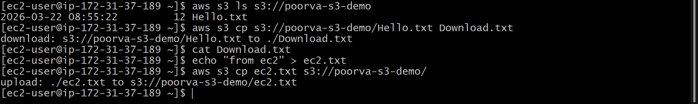

# 🚀 AWS S3 Hands-on Project

## 📌 Overview

This project demonstrates the creation and usage of an Amazon S3 bucket, including uploading, accessing, and managing objects using both the AWS Management Console and AWS CLI via an EC2 instance.

---

## 🧰 Services Used

* Amazon S3 (Simple Storage Service)
* Amazon EC2
* AWS CLI

---

## 🎯 Objectives

* Create and configure an S3 bucket
* Upload and manage files in S3
* Access S3 from an EC2 instance using AWS CLI
* Understand basic S3 operations and commands

---

## 🏗️ Architecture

EC2 Instance ↔ AWS CLI ↔ S3 Bucket

---

## ⚙️ Step-by-Step Implementation

### 1️⃣ Create S3 Bucket

* Navigate to AWS Console → S3
* Click **Create Bucket**
* Provide a unique bucket name
* Select region
* Keep **Block Public Access ON**
* Create bucket

---

### 2️⃣ Upload File to S3

* Open the created bucket
* Click **Upload**
* Add file (example: `Hello.txt`)
* Upload successfully

---

### 3️⃣ Configure AWS CLI on EC2

```bash
aws configure
```

Provide:

* Access Key
* Secret Access Key
* Region
* Output format (json)

---

### 4️⃣ List S3 Buckets

```bash
aws s3 ls
```

---

### 5️⃣ Download File from S3

```bash
aws s3 cp s3://poorva-s3-demo/Hello.txt Download.txt
```

---

### 6️⃣ Verify File Content

```bash
cat Download.txt
```

---

### 7️⃣ Upload File from EC2 to S3

```bash
echo "Hello from EC2" > ec2.txt
aws s3 cp ec2.txt s3://poorva-s3-demo/
```

---

## 📸 Screenshots

### Bucket Creation
 


### File Upload



### AWS CLI commands



### File Download verification



---

## 📚 Key Learnings

* S3 is an object storage service
* AWS CLI enables interaction with S3 programmatically
* EC2 can securely access S3 using credentials
* Basic S3 operations: upload, download, list

---

## 🔐 Best Practices Followed

* Enabled block public access
* Used IAM credentials for secure access
* Avoided hardcoding sensitive information

---

## 🧑‍💻 Author

Gajavelli Pranathi Poorva

---

## ⭐ Conclusion

This project provides a foundational understanding of Amazon S3 and its integration with EC2 using AWS CLI, which is essential for cloud and DevOps workflows.


